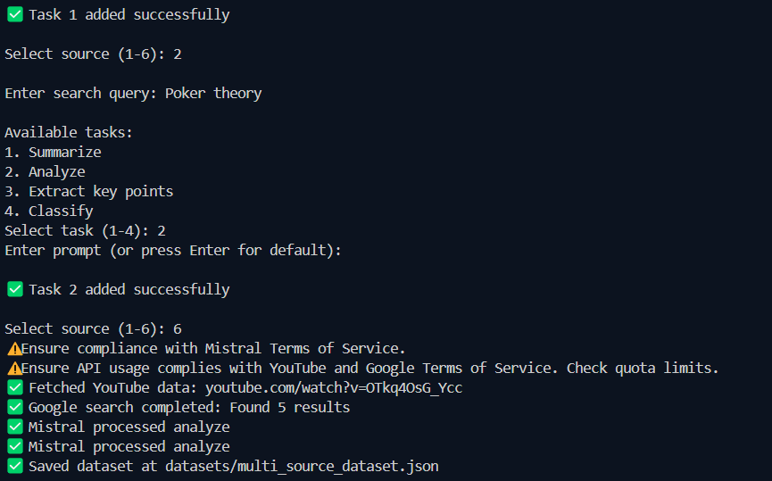

<div align="center">


</div>

# InsightCrafter

InsightCrafter is a Python-based tool designed to collect and process data from various sources, including YouTube videos, Google search results, web pages, and PDF documents. It leverages the Mistral API for advanced text processing capabilities, such as summarization, analysis, key point extraction, and classification.

## Features

- **Multiple Data Sources**: Supports data collection from YouTube, Google Search, web pages, and PDF files.
- **Interactive Task Creation**: User-friendly command-line interface for creating and configuring tasks.
- **Mistral API Integration**: Utilizes the Mistral API for powerful text processing.
- **Robust Error Handling**: Includes comprehensive error handling and retry mechanisms for API requests.
- **Data Validation**: Improved input validation to ensure correct data formats (URLs, file paths, etc.).
- **Configurable Output**: Saves processed data in JSON or CSV format.
- **Progress Indicators**: Displays real-time progress updates during data fetching and processing.
- **Temporary File Handling**: Automatically removes temporary PDF files after processing.

## Requirements

- Python 3.7 or higher
- Mistral API key
- YouTube API key (optional, for YouTube data source)
- Google API key and Custom Search Engine ID (optional, for Google Search data source)
- Required Python packages (listed in `requirements.txt`)
- 




## Installation

1. Clone the repository:
   ```
   git clone https://github.com/Zombitx64/Insightcrafter.git
   cd InsightCrafter
   ```

2. Install the required packages:
   ```
   pip install -r requirements.txt
   ```

3. Set up API keys:
   - Create a `.env` file in the project root directory.
   - Add your Mistral API key, YouTube API key (optional), Google API key (optional), and Custom Search Engine ID (optional) to the `.env` file:
     ```
     MISTRAL_API_KEY=your_mistral_api_key
     YOUTUBE_API_KEY=your_youtube_api_key
     GOOGLE_API_KEY=your_google_api_key
     CSE_ID=your_custom_search_engine_id
     ```
   - Alternatively, you can add the API keys to `config.json`:
      ```json
      {
        "mistral_api_key": "your_mistral_api_key",
        "youtube_api_key": "your_youtube_api_key",
        "google_api_key": "your_google_api_key",
        "cse_id": "your_cse_id"
      }
      ```

## Usage

Run the script `Insightcrafter_zombitx64.py` to start the interactive task creation process:

```
python Insightcrafter_zombitx64.py
```

Follow the on-screen prompts to select data sources, enter queries, choose tasks, and provide prompts. The script will fetch and process the data, and then save the results in a JSON or CSV file in the `datasets` directory.

### Example

1.  **Select source**: Choose YouTube (option 1).
2.  **Enter YouTube video URL**: Provide a valid YouTube video URL.
3.  **Select task**: Choose Summarize (option 1).
4.  **Enter prompt**: Press Enter to use the default prompt.
5.  **Add more tasks or finish**: Choose option 6 to finish adding tasks.

The script will then process the data and save the results.

## Configuration

You can configure the following options in the `config.json` file:

-   `mistral_api_key`: Your Mistral API key.
-   `youtube_api_key`: Your YouTube API key (optional).
-   `google_api_key`: Your Google API key (optional).
-   `cse_id`: Your Google Custom Search Engine ID (optional).

## Contributing

Contributions are welcome! Please feel free to submit pull requests or open issues to suggest improvements or report bugs.

## License

This project is licensed under the MIT License - see the [LICENSE](LICENSE) file for details.
